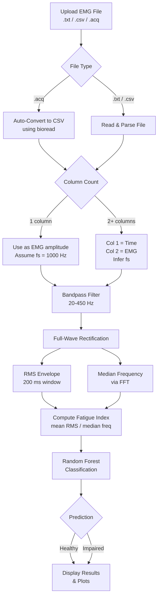

# EMG Fatigue Detection and Muscle Health Classification

A web-based tool for analyzing Electromyography (EMG) signals to detect muscle fatigue and classify muscle health using signal processing and machine learning.

## Features

- **EMG Signal Upload** — Supports `.txt`, `.csv`, and `.acq` file formats with automatic delimiter detection.
- **ACQ Auto-Conversion** — BioPac `.acq` files are automatically converted to CSV format on upload (no manual conversion needed).
- **Signal Preprocessing** — Bandpass filtering (20–450 Hz) and full-wave rectification.
- **RMS Envelope** — Computes the Root Mean Square envelope over a 200 ms sliding window.
- **Median Frequency** — Calculates the median frequency of the filtered signal via FFT.
- **Fatigue Index** — Derives a fatigue index from the ratio of mean RMS to median frequency.
- **ML Classification** — Classifies the muscle condition as **Healthy** or **Impaired** using a Random Forest classifier.
- **Interactive Plots** — Displays the raw EMG signal and RMS envelope through a Gradio web UI.

## Project Structure

| File | Description |
|---|---|
| `main.py` | Gradio web app — EMG analysis pipeline and UI |
| `convert.py` | Converts BioPac `.acq` files to CSV using `bioread` |
| `ABEL-HAM.acq` | Sample BioPac acquisition file |
| `requirements.txt` | Python dependencies |

## Requirements

- Python 3.8+
- Dependencies listed in `requirements.txt`:
  - `gradio`
  - `numpy`
  - `pandas`
  - `matplotlib`
  - `scipy`
  - `scikit-learn`
  - `biopython`
  - `bioread`

## Installation

```bash
pip install -r requirements.txt
```

## Usage

### Launch the web app

```bash
python main.py
```

A Gradio interface will open in your browser. Upload a `.txt`, `.csv`, or `.acq` file containing EMG data.

**Note:** BioPac `.acq` files are automatically converted to CSV format during upload — no manual conversion needed!

#### Input format

- **ACQ files** — Automatically converted to CSV format using the first channel data.
- **Single column** — Treated as EMG amplitude. A time axis is generated assuming a 1000 Hz sampling rate.
- **Two+ columns** — First column is treated as time (seconds), second as EMG amplitude. Sampling frequency is inferred from the time column.

#### Output

- Sampling frequency, mean RMS, median frequency, fatigue index, and muscle condition classification.
- Raw EMG signal plot.
- RMS envelope plot.

## Flowchart



## How It Works

1. **Bandpass Filter** — A 4th-order Butterworth filter isolates the 20–450 Hz EMG frequency band.
2. **Rectification** — The filtered signal is full-wave rectified (absolute value).
3. **RMS Envelope** — A sliding-window RMS is computed over a 200 ms window.
4. **Median Frequency** — The frequency at which the cumulative power spectrum reaches 50%.
5. **Fatigue Index** — `mean(RMS) / median_frequency`. Higher values may indicate fatigue.
6. **Classification** — A Random Forest model trained on reference feature vectors predicts **Healthy** or **Impaired**.
